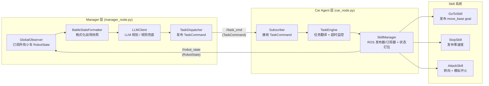

# 技术原理

本文档介绍 robot_vs 项目的核心技术设计，包括系统分层架构、Manager 决策机制、Car Agent 与 Skill 系统、ROS 消息流，以及多机话题隔离与坐标系管理。

---

## 目录

- [1. 系统架构概览](#1-系统架构概览)
- [2. 数据流图](#2-数据流图)
- [3. Manager 层](#3-manager-层)
- [4. Car Agent 层](#4-car-agent-层)
- [5. Skill 系统](#5-skill-系统)
- [6. ROS 消息流](#6-ros-消息流)
- [7. 多机器人命名空间与话题管理](#7-多机器人命名空间与话题管理)
- [8. TF 坐标系前缀隔离](#8-tf-坐标系前缀隔离)
- [9. 仿真与现实的一致性设计](#9-仿真与现实的一致性设计)

---

## 1. 系统架构概览

系统分为三层，红蓝双方**各自独立**运行一套完整的链路：

```
红方阵营                              蓝方阵营
────────────────────                 ────────────────────
Manager 层                           Manager 层
(manager_node.py)                    (manager_node.py)
     │ TaskCommand                        │ TaskCommand
     ▼                                    ▼
Car Agent 层 × N                    Car Agent 层 × N
(car_node.py)                        (car_node.py)
     │                                    │
     ▼                                    ▼
Skill 系统                           Skill 系统
GoToSkill/StopSkill/AttackSkill      GoToSkill/StopSkill/AttackSkill
     │ RobotState                         │ RobotState
     ▲──────────────────                  ▲──────────────────
     Manager 层                           Manager 层
```

每个阵营由以下节点组成：

| 节点 | 脚本 | 说明 |
|------|------|------|
| Manager | `scripts/manager/manager_node.py` | 感知战场、调用 LLM、分发任务 |
| Car Agent × N | `scripts/car/car_node.py` | 每辆小车独立运行一个实例 |
| Skill | `scripts/car/skills/` | 技能库，由 Car Agent 内部调用 |

---

## 2. 数据流图



> 若 Markdown 渲染器不支持 Mermaid，请参考下方 ASCII 版本。  
> 图中 `<ns>` 为小车的命名空间占位符，例如 `robot_red`、`robot_blue`。红蓝双方各自运行一套独立的 Manager + Car Agent 链路。

**ASCII 简版：**

```
LLM / Manager
     │  TaskCommand  (/<ns>/task_cmd)
     ▼
Car Agent (car_node.py)
  ├─ task_engine.py   ←→  skill_manager.py
  │       │                    │
  │  accept_task()        make_skill()
  │  tick() + timeout     publish_nav_goal()
  │                        publish_cmd_vel()
  │                        _publish_robot_state() → 10 Hz
  └──────────────────────→ Skills
                              GoToSkill → /<ns>/move_base_simple/goal
                              StopSkill → /<ns>/cmd_vel (零速)
                              AttackSkill → /<ns>/cmd_vel (转向) + 开火信号
     ▲  RobotState  (/<ns>/robot_state)
     │
Manager (GlobalObserver)
```

---

## 3. Manager 层

**位置：** `scripts/manager/`

Manager 是每个阵营的"指挥中枢"，以固定频率（`loop_hz`，默认 1 Hz）循环执行以下步骤：

```
1. GlobalObserver.get_battle_state()   → 收集所有小车的最新 RobotState
2. BattleStateFormatter.build()        → 将状态格式化成 LLM 可读的文本
3. LLMClient.plan_tasks()              → 调用 LLM（或规则引擎）生成任务字典
4. TaskDispatcher.dispatch()           → 将任务逐一发布为 TaskCommand 消息
```

### 关键组件

| 文件 | 职责 |
|------|------|
| `manager_node.py` | 节点入口，组装上述四个组件并驱动循环 |
| `global_observer.py` | 订阅所有 `/<ns>/robot_state`，超过 `state_timeout_s` 未更新则标记失联 |
| `battle_state_formatter.py` | 将 RobotState 字典转换为 LLM Prompt 文本 |
| `llm_client.py` | 调用 LLM API，解析返回的 JSON 任务列表；LLM 不可用时走规则兜底 |
| `task_dispatcher.py` | 为每辆小车发布 `TaskCommand`；相同任务不重复下发（去重机制保护） |

### 参数配置

Manager 通过 `config/manager/red_manager.yaml`（或 `blue_manager.yaml`）加载参数：

```yaml
team_color: "red"
my_cars: ["robot_red"]   # 本阵营管理的小车命名空间列表
loop_hz: 1.0             # 决策频率 (Hz)
state_timeout_s: 5.0     # 超过此秒数未收到小车状态则标记失联
default_patrol_points:   # LLM 不可用时的默认巡逻点
  - [0.5, 0.0]
  - [1.0, 1.0]
llm:
  enabled: false         # true 时调用真实 LLM API
  model: "gpt-4o-mini"
  timeout_s: 8
```

### 启动

```bash
roslaunch robot_vs managers.launch
```

---

## 4. Car Agent 层

**位置：** `scripts/car/`

每辆小车在启动时运行一个独立的 `car_node.py` 进程。多辆小车运行**相同的代码**，通过 ROS 命名空间区分身份。

### 三大组件分工

| 文件 | 职责 |
|------|------|
| `car_node.py` | 节点入口：`rospy.init_node()`，订阅 `TaskCommand`，以 `loop_hz` 频率调用 `task_engine.tick()` |
| `task_engine.py` | 任务翻译官：保存当前任务，根据 `action_type` 切换技能，检测任务超时 |
| `skill_manager.py` | 资源管家：持有所有 ROS Publisher/Subscriber，创建技能实例，每 0.1 秒发布 `RobotState` |

**car_node.py 不涉及任何导航逻辑，task_engine.py 不直接调用 ROS 话题，** 所有 ROS 通信均集中在 `skill_manager.py`。

### 命名空间自识别

```python
# car_node.py
self.ns = rospy.get_namespace().strip("/")  # 例如 "robot_red"
```

小车通过 launch 文件的 `<group ns="robot_red">` 标签获得命名空间，之后所有话题均自动挂载在该前缀下，无需硬编码。

### 任务去重机制

`task_engine.py` 在 `accept_task()` 中检查 `task_id`：
- 若新任务与当前任务的 `task_id` **相同**，直接忽略（避免 Manager 高频下发导致频繁打断导航）。
- 只有 `task_id` **发生变化**时，才会停止当前技能并切换到新技能。

### 参数配置

Car Agent 通过 `config/car/red_car.yaml`（或 `blue_car.yaml`）加载参数：

```yaml
loop_hz: 10.0      # 主循环频率 (Hz)
team: 0            # 0 = 红方, 1 = 蓝方
default_hp: 100.0  # 初始血量
default_ammo: 50.0 # 初始弹药
```

### 启动

```bash
roslaunch robot_vs cars.launch
```

---

## 5. Skill 系统

**位置：** `scripts/car/skills/`

每个 Skill 继承 `BaseSkill`，实现 `start(task)`、`update() → str`、`stop()` 三个方法。  
`update()` 必须返回以下三个字符串之一，驱动任务状态机流转：

| 返回值 | 含义 |
|--------|------|
| `"RUNNING"` | 技能执行中，继续等待 |
| `"SUCCESS"` | 技能执行成功，可接受新任务 |
| `"FAILED"` | 技能执行失败（超时/障碍等），Manager 会重新规划 |

### 技能列表

| Skill | 文件 | 触发条件 | 行为 |
|-------|------|----------|------|
| `GoToSkill` | `goto_skill.py` | `action_type = "GOTO"` | 向 `/<ns>/move_base_simple/goal` 发布目标点；监听 `/<ns>/move_base/result` 判断到达 |
| `StopSkill` | `stop_skill.py` | `action_type = "STOP"` | 向 `/<ns>/cmd_vel` 发布零速度 Twist；立即返回 SUCCESS |
| `AttackSkill` | `attack_skill.py` | `action_type = "ATTACK"` | 先停车，再计算目标方位，发布 `cmd_vel` 转向瞄准，模拟攻击延时后返回 SUCCESS |

### mode 字段

`TaskCommand.mode` 和 `RobotState.mode` 均携带模式信息，用于表达车辆当前状态：

| 值 | 含义 |
|----|------|
| `0` | 待机 |
| `1` | 巡逻（配合 GOTO） |
| `2` | 攻击（配合 ATTACK） |

---

## 6. ROS 消息流

### TaskCommand（Manager → Car）

**话题：** `/<ns>/task_cmd`  
**文件：** `msg/TaskCommand.msg`

```
uint32  task_id       # 任务流水号（递增，相同 ID = 同一任务）
string  action_type   # 动作类型：GOTO / STOP / ATTACK
string  reason        # LLM 给出的战术意图（仅供日志记录）
float32 target_x      # 目标 X 坐标（GOTO 终点 / ATTACK 瞄准点）
float32 target_y      # 目标 Y 坐标
uint8   mode          # 期望模式：0 待机 / 1 巡逻 / 2 攻击
float32 timeout       # 任务超时时间 (秒)，超时自动取消
```

### RobotState（Car → Manager）

**话题：** `/<ns>/robot_state`  
**文件：** `msg/RobotState.msg`  
**发布频率：** 10 Hz（由 `SkillManager` 定时器驱动）

```
std_msgs/Header header

# 身份与基础信息
string  robot_ns
uint8   team

# 战斗与生存状态
float32 hp
float32 ammo
bool    alive
bool    in_combat

# 运动学状态
geometry_msgs/Pose  pose
geometry_msgs/Twist twist

# 任务执行反馈（Manager 闭环控制的核心）
uint32  current_task_id   # 正在执行或刚完成的任务 ID
string  current_action    # 当前动作：GOTO / STOP / ATTACK
string  task_status       # 执行状态：RUNNING / SUCCESS / FAILED / IDLE
uint8   mode              # 当前物理模式
```

### 超时机制总览

系统共有三层超时保护：

| 超时参数 | 位置 | 防止的问题 |
|----------|------|------------|
| `state_timeout_s`（Manager） | `global_observer.py` | 小车失联时 Manager 不会用过期数据决策 |
| `TaskCommand.timeout`（Car） | `task_engine.py` | 小车执行任务超时时自动上报 FAILED 并刹车 |
| `llm.timeout_s`（Manager） | `llm_client.py` | LLM API 无响应时 Manager 走规则兜底 |

---

## 7. 多机器人命名空间与话题管理

每辆小车的所有话题都挂载在其专属的命名空间下，实现多机话题隔离：

```
/robot_red/task_cmd          ← Manager 下发任务
/robot_red/robot_state       → Manager 接收反馈
/robot_red/move_base_simple/goal
/robot_red/cmd_vel
/robot_red/odom
/robot_red/amcl_pose
/robot_red/move_base/result

/robot_blue/task_cmd
/robot_blue/robot_state
...
```

命名空间由 `launch/car/cars.launch` 中的 `<group ns="...">` 标签注入，代码层面通过 `rospy.get_namespace()` 动态读取，无需硬编码。

---

## 8. TF 坐标系前缀隔离

为所有 TF 变换增加 **前缀 (prefix)**，使得每辆小车的 TF 树互相独立：

- 例如：`robot_red/base_link`、`robot_blue/base_link`

利用前缀隔离不同机器人之间的坐标系，避免 TF 冲突和混淆。Manager 层可根据前缀选择性地订阅和使用对应小车的 TF 信息。

---

## 9. 仿真与现实的一致性设计

### 仿真环境

- 在 Gazebo 仿真中，多个小车 agent 通过命名空间和 TF 前缀实现完全独立运行
- 红方 / 蓝方 Manager 可以在仿真中实现策略开发与对抗算法验证
- 仿真与现实在话题结构上尽量保持一致，便于算法迁移
- 提供编辑好的 Rviz 可视化界面

### 现实环境（进行中）

- 现实系统正在制作与调试中，设计目标为：
  - 所有机器人与上位机共用 **同一个 rosmaster**
  - 主机（上位机 / 管理机）与从机（车载计算单元）在 **同一局域网** 内通信
  - 继续沿用仿真中的 **命名空间 + TF 前缀** 设计，保证多车并行运行与话题隔离
