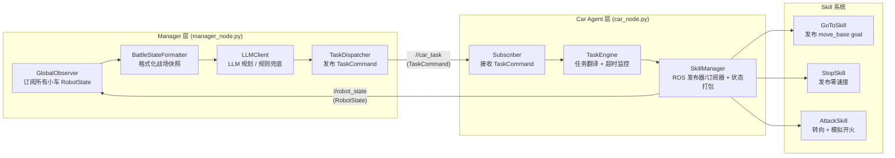

# 技术原理

本文档介绍 robot_vs 项目的核心技术设计，包括系统分层架构、Manager 决策机制、Car Agent 与 Skill 系统、ROS 消息流，以及多机话题隔离与坐标系管理。

---

## 目录

- [1. 系统架构概览](#1-系统架构概览)
- [2. 数据流图](#2-数据流图)
- [3. Manager 层](#3-manager-层)
- [4. Car Agent 层](#4-car-agent-层)
- [5. Skill 系统](#5-skill-系统)
- [6. ROS 消息流](#6-ros-消息流)
- [7. 多机器人命名空间与话题管理](#7-多机器人命名空间与话题管理)
- [8. TF 坐标系前缀隔离](#8-tf-坐标系前缀隔离)
- [9. 仿真与现实的一致性设计](#9-仿真与现实的一致性设计)
- [10. 比赛状态机与裁判判定](#10-比赛状态机与裁判判定)
- [11. 仿真定位与导航链路](#11-仿真定位与导航链路)

---

## 1. 系统架构概览

系统分为三层，红蓝双方**各自独立**运行一套完整的链路：

```
红方阵营                              蓝方阵营
────────────────────                 ────────────────────
Manager 层                           Manager 层
(manager_node.py)                    (manager_node.py)
     │ TaskCommand                        │ TaskCommand
     ▼                                    ▼
Car Agent 层 × N                    Car Agent 层 × N
(car_node.py)                        (car_node.py)
     │                                    │
     ▼                                    ▼
Skill 系统                           Skill 系统
GoToSkill/StopSkill/AttackSkill      GoToSkill/StopSkill/AttackSkill
     │ RobotState                         │ RobotState
     ▲──────────────────                  ▲──────────────────
     Manager 层                           Manager 层
```

每个阵营由以下节点组成：

| 节点 | 脚本 | 说明 |
|------|------|------|
| Manager | `scripts/manager/manager_node.py` | 感知战场、调用 LLM、分发任务 |
| Car Agent × N | `scripts/car/car_node.py` | 每辆小车独立运行一个实例 |
| Skill | `scripts/car/skills/` | 技能库，由 Car Agent 内部调用 |

---

## 2. 数据流图


```mermaid
flowchart LR
    subgraph Manager["Manager 层 (manager_node.py)"]
        OBS["GlobalObserver\n订阅所有小车 RobotState"]
        FMT["BattleStateFormatter\n格式化战场快照"]
        LLM["LLMClient\nLLM 规划 / 规则兜底"]
        DIS["TaskDispatcher\n发布 TaskCommand"]
        OBS --> FMT --> LLM --> DIS
    end

    subgraph Car["Car Agent 层 (car_node.py)"]
        SUB["Subscriber\n接收 TaskCommand"]
        TE["TaskEngine\n任务翻译 + 超时监控"]
        SM["SkillManager\nROS 发布器/订阅器 + 状态打包"]
        SUB --> TE --> SM
    end

    subgraph Skills["Skill 系统"]
        G["GoToSkill\n发布 move_base goal"]
        S["StopSkill\n发布零速度"]
        A["AttackSkill\n转向 + 模拟开火"]
    end

    DIS -- "/<ns>/car_task\n(TaskCommand)" --> SUB
    SM -- "/<ns>/robot_state\n(RobotState)" --> OBS
    SM --> G & S & A
```

> 若 Markdown 渲染器不支持 Mermaid，请参考下方 ASCII 版本。  
> 图中 `<ns>` 为小车的命名空间占位符，例如 `robot_red`、`robot_blue`。红蓝双方各自运行一套独立的 Manager + Car Agent 链路。

**ASCII 简版：**

```
LLM / Manager
     │  TaskCommand  (/<ns>/car_task)
     ▼
Car Agent (car_node.py)
  ├─ task_engine.py   ←→  skill_manager.py
  │       │                    │
  │  accept_task()        make_skill()
  │  tick() + timeout     publish_nav_goal()
  │                        publish_cmd_vel()
  │                        _publish_robot_state() → 10 Hz
  └──────────────────────→ Skills
                              GoToSkill → /<ns>/cmd_vel (转向 + 前进)
                              StopSkill → /<ns>/cmd_vel (零速) + /<ns>/move_base/cancel
                              AttackSkill → /<ns>/cmd_vel (转向追击) + /<ns>/fire_event
                              RotateSkill → /<ns>/cmd_vel (原地旋转到 target_yaw)
                              RetreatSkill → /<ns>/cmd_vel (向撤退点移动)
     ▲  RobotState  (/<ns>/robot_state)
     │
Manager (GlobalObserver)
```

---

## 3. Manager 层

**位置：** `scripts/manager/`

Manager 是每个阵营的"指挥中枢"，以固定频率（`loop_hz`，默认 20 Hz）循环执行以下步骤：

```
1. GlobalObserver.get_battle_state()   → 收集所有小车的最新 RobotState
2. BattleStateFormatter.build()        → 将状态格式化成 LLM 可读的文本
3. LLMClient.plan_tasks()              → 调用 LLM（或规则引擎）生成任务字典
4. TaskDispatcher.dispatch()           → 将任务逐一发布为 TaskCommand 消息
```

### 关键组件

| 文件 | 职责 |
|------|------|
| `manager_node.py` | 节点入口，组装上述四个组件并驱动循环 |
| `global_observer.py` | 订阅所有 `/<ns>/robot_state`，超过 `state_timeout_s` 未更新则标记失联 |
| `battle_state_formatter.py` | 将 RobotState 字典转换为 LLM Prompt 文本 |
| `llm_client.py` | 调用 LLM API，解析返回的 JSON 任务列表；LLM 不可用时走规则兜底 |
| `task_dispatcher.py` | 为每辆小车发布 `TaskCommand`；相同任务不重复下发（去重机制保护） |

LLM 不可用（`llm.enabled: false` 或请求失败）时，`llm_client.py` 会走内置的**规则博弈**：

1. 角色分配：按"离敌人距离 0.8 + 朝向 0.1 + 血量 0.1"打分，得分最高的 3 台分别担任 `Attack` / `Support-1` / `Support-2`（不足 3 台时全部为 `Attack`）。
2. 目标选择：`Attack` 与 `Support-1` 集火威胁度最高的敌人，`Support-2` 优先补刀残血敌人。
3. 战术选择：按双方总血量比切换 `aggressive` / `balanced` / `defensive`。
4. 人数分支：己方人数占优 → 追击；人数劣势 → 一车进攻、其余撤退；持平 → 平衡推进。
5. 血量低于 20 → 最高优先级撤退（`RETREAT`）。
6. **无敌方线索时的侦察**：朝对方半场巡逻，在两条纵深线之间每
   `scout_dwell_s`（默认 8 s，写在 `config/manager/*_manager.yaml`）换一次目标，
   红蓝镜像以免两队把同一个坐标当目标撞在一起；如果已经有敌方历史位置，
   则推进到最后已知位置附近并散开（半径约 0.9 m），不再全队挤向同一点。

### 参数配置

Manager 通过 `config/manager/red_manager.yaml`（或 `blue_manager.yaml`）加载参数：

```yaml
team_color: "red"
my_cars: ["robot_red1", "robot_red2", "robot_red3"]  # 本阵营管理的小车命名空间列表
loop_hz: 20.0            # 决策频率 (Hz)
state_timeout_s: 2.0     # 超过此秒数未收到小车状态则标记失联
default_patrol_points: []  # 为空时使用 LLMClient 内置的默认巡逻点
llm:
  enabled: false         # true 时调用 LLM 规划服务
  service_url: "http://127.0.0.1:8001/plan"   # 蓝方使用 8002
  timeout_s: 30
```

### 启动

```bash
roslaunch robot_vs managers.launch
```

---

## 4. Car Agent 层

**位置：** `scripts/car/`

每辆小车在启动时运行一个独立的 `car_node.py` 进程。多辆小车运行**相同的代码**，通过 ROS 命名空间区分身份。

### 三大组件分工

| 文件 | 职责 |
|------|------|
| `car_node.py` | 节点入口：`rospy.init_node()`，订阅 `TaskCommand`，以 `loop_hz` 频率调用 `task_engine.tick()` |
| `task_engine.py` | 任务翻译官：保存当前任务，根据 `action_type` 切换技能，检测任务超时 |
| `skill_manager.py` | 资源管家：持有所有 ROS Publisher/Subscriber，创建技能实例，每 0.1 秒发布 `RobotState` |

**car_node.py 不涉及任何导航逻辑，task_engine.py 不直接调用 ROS 话题，** 所有 ROS 通信均集中在 `skill_manager.py`。

### 命名空间自识别

```python
# car_node.py
self.ns = rospy.get_namespace().strip("/")  # 例如 "robot_red"
```

小车通过 launch 文件的 `<group ns="robot_red">` 标签获得命名空间，之后所有话题均自动挂载在该前缀下，无需硬编码。

### 任务去重机制

`task_engine.py` 在 `accept_task()` 中检查 `task_id`：
- 若新任务与当前任务的 `task_id` **相同**，直接忽略（避免 Manager 高频下发导致频繁打断导航）。
- 只有 `task_id` **发生变化**时，才会停止当前技能并切换到新技能。

### 参数配置

Car Agent 通过 `config/car/red_car.yaml`（或 `blue_car.yaml`）加载参数：

```yaml
loop_hz: 10.0      # 主循环频率 (Hz)
team: 0            # 0 = 红方, 1 = 蓝方
default_hp: 100.0  # 初始血量
default_ammo: 50.0 # 初始弹药
```

### 启动

```bash
roslaunch robot_vs cars.launch
```

---

## 5. Skill 系统

**位置：** `scripts/car/skills/`

每个 Skill 继承 `BaseSkill`，实现 `start(task)`、`update() → str`、`stop()` 三个方法。  
`update()` 必须返回以下三个字符串之一，驱动任务状态机流转：

| 返回值 | 含义 |
|--------|------|
| `"RUNNING"` | 技能执行中，继续等待 |
| `"SUCCESS"` | 技能执行成功，可接受新任务 |
| `"FAILED"` | 技能执行失败（超时/障碍等），Manager 会重新规划 |

### 技能列表

| Skill | 文件 | 触发条件 | 行为 |
|-------|------|----------|------|
| `GoToSkill` | `goto_skill.py` | `action_type = "GOTO"` | 默认走 move_base：发布 `/<ns>/move_base_simple/goal`，等 `/<ns>/move_base/result`（SUCCEEDED→SUCCESS，ABORTED/REJECTED→FAILED）。`~use_move_base: false` 时退化为纯 `cmd_vel` 转向+直行（无避障） |
| `StopSkill` | `stop_skill.py` | `action_type = "STOP"` | 取消 move_base 目标并向 `/<ns>/cmd_vel` 发布零速度 Twist；立即返回 SUCCESS |
| `AttackSkill` | `attack_skill.py` | `action_type = "ATTACK"` | 比例转向（`align_gain * err`，带限幅）+ 追击前进；误差大时原地对准、小时边走边修；车头激光扇区内有障碍则停止前进并绕行；朝向误差小于开火角（还会按 `弹道半宽 / 距离` 收紧）才按 `fire_cooldown_s` 冷却发布 `FireEvent` |
| `RotateSkill` | `rotate_skill.py` | `action_type = "ROTATE"` | 原地旋转到 `target_yaw`，误差进入 `yaw_tolerance` 后返回 SUCCESS |
| `RetreatSkill` | `retreat_skill.py` | `action_type = "RETREAT"` | 朝远离敌人的撤退点移动，到达或超时后结束 |

> `AttackSkill` 是**持续型**技能：只要还能看到位姿就保持 RUNNING 并反复开火，靠 `TaskCommand.timeout` 与 Manager 的下一轮决策来收尾。
>
> GOTO 的直行回退模式与 ATTACK 追击共用 `skills/steering.py` 里的 `AvoidanceSteering`：
> 比例转向 + "朝目标的射线被挡就沿固定绕行航向直行"。**绕行航向必须固定在
> 世界坐标系**——若每帧都追"当前目标方位 ±90°"，目标方位会随车头一起转，
> 车就会陷入无限自转（这正是"车只在原地转、不往前走"的成因）。

### mode 字段

`TaskCommand.mode` 和 `RobotState.mode` 均携带模式信息，用于表达车辆当前状态：

| 值 | 含义 |
|----|------|
| `0` | 待机 |
| `1` | 巡逻（配合 GOTO） |
| `2` | 攻击（配合 ATTACK） |

---

## 6. ROS 消息流

### TaskCommand（Manager → Car）

**话题：** `/<ns>/car_task`  
**文件：** `msg/TaskCommand.msg`

```
uint32  task_id       # 任务流水号（递增，内容相同的任务复用同一 ID）
string  action_type   # 动作类型：GOTO / STOP / ATTACK / ROTATE / RETREAT
string  reason        # LLM 给出的战术意图（仅供日志记录）
float32 target_x      # 目标 X 坐标（GOTO 终点 / ATTACK 瞄准点）
float32 target_y      # 目标 Y 坐标
float32 target_yaw    # ROTATE 的目标朝向（弧度）
uint8   mode          # 期望模式：0 待机 / 1 巡逻 / 2 攻击
float32 timeout       # 任务超时时间 (秒)，超时自动取消
```

> `task_id` 去重只对**仍在执行（RUNNING）**的任务生效；任务进入 SUCCESS / FAILED 后，
> 相同 `task_id` 的任务可以被重新下发，避免小车超时后永久停在原地。

### RobotState（Car → Manager）

**话题：** `/<ns>/robot_state`  
**文件：** `msg/RobotState.msg`  
**发布频率：** 10 Hz（由 `SkillManager` 定时器驱动）

```
std_msgs/Header header

# 身份与基础信息
string  robot_ns
uint8   team

# 战斗与生存状态
float32 hp
float32 ammo
bool    alive
bool    in_combat

# 运动学状态
geometry_msgs/Pose  pose
geometry_msgs/Twist twist
float32 yaw

# 任务执行反馈（Manager 闭环控制的核心）
uint32  current_task_id   # 正在执行或刚完成的任务 ID
string  current_action    # 当前动作：GOTO / STOP / ATTACK
string  task_status       # 执行状态：RUNNING / SUCCESS / FAILED / IDLE
uint8   mode              # 当前物理模式
```

### 超时机制总览

系统共有三层超时保护：

| 超时参数 | 位置 | 防止的问题 |
|----------|------|------------|
| `state_timeout_s`（Manager） | `global_observer.py` | 小车失联时 Manager 不会用过期数据决策 |
| `TaskCommand.timeout`（Car） | `task_engine.py` | 小车执行任务超时时自动上报 FAILED 并刹车 |
| `llm.timeout_s`（Manager） | `llm_client.py` | LLM API 无响应时 Manager 走规则兜底 |

---

## 7. 多机器人命名空间与话题管理

每辆小车的所有话题都挂载在其专属的命名空间下，实现多机话题隔离：

```
/robot_red/car_task          ← Manager 下发任务
/robot_red/robot_state       → Manager 接收反馈
/robot_red/move_base_simple/goal
/robot_red/cmd_vel
/robot_red/odom
/robot_red/amcl_pose
/robot_red/move_base/result
/robot_red/fire_event

# 说明：move_base_simple/goal 发布器由 SkillManager 保留，当前 GoToSkill 走 cmd_vel，
#       该话题仅作为后续接入 move_base 时的预留接口。
/robot_red/move_base_simple/goal

/robot_blue/car_task
/robot_blue/robot_state
...
```

命名空间由 `launch/car/cars.launch` 中的 `<group ns="...">` 标签注入，代码层面通过 `rospy.get_namespace()` 动态读取，无需硬编码。

---

## 8. TF 坐标系前缀隔离

为所有 TF 变换增加 **前缀 (prefix)**，使得每辆小车的 TF 树互相独立：

- 例如：`robot_red/base_link`、`robot_blue/base_link`

利用前缀隔离不同机器人之间的坐标系，避免 TF 冲突和混淆。Manager 层可根据前缀选择性地订阅和使用对应小车的 TF 信息。

---

## 9. 仿真与现实的一致性设计

### 仿真环境

- 在 Gazebo 仿真中，多个小车 agent 通过命名空间和 TF 前缀实现完全独立运行
- 红方 / 蓝方 Manager 可以在仿真中实现策略开发与对抗算法验证
- 仿真与现实在话题结构上尽量保持一致，便于算法迁移
- 提供编辑好的 Rviz 可视化界面

### 现实环境（进行中）

- 现实系统正在制作与调试中，设计目标为：
  - 所有机器人与上位机共用 **同一个 rosmaster**
  - 主机（上位机 / 管理机）与从机（车载计算单元）在 **同一局域网** 内通信
  - 继续沿用仿真中的 **命名空间 + TF 前缀** 设计，保证多车并行运行与话题隔离

---

## 10. 比赛状态机与裁判判定

### 状态流转

```
IDLE ──start──▶ PLAYING ──一方全灭 / 超时──▶ FINISHED ──reset──▶ IDLE
  ▲                                            │
  └──────────────── stop ──────────────────────┘
```

裁判节点（`referee_node.py`）持有唯一的比赛状态，并通过 `/game/state`（`GameState`）以 10 Hz 广播；
Manager 订阅该话题，**只有 `PLAYING` 状态才会进入规划循环**：

| 状态 | Manager 行为 |
|------|--------------|
| `IDLE` | 先补发一次 `STOP`（避免残留任务让车继续跑），随后空转等待 |
| `PLAYING` | 正常执行 观测 → 规划 → 分发 循环 |
| `FINISHED` | 持续向本方所有小车下发 `STOP` |

### 控制指令

裁判订阅 `/game/command`（`std_msgs/String`），支持三条指令：

```bash
# 开始比赛
rostopic pub -1 /game/command std_msgs/String "data: 'start'"
# 中止比赛（回到 IDLE）
rostopic pub -1 /game/command std_msgs/String "data: 'stop'"
# 复位：恢复所有已发现机器人的 HP/弹药，并回到 IDLE
rostopic pub -1 /game/command std_msgs/String "data: 'reset'"
```

### 结束条件

| 条件 | `winner` | `reason` |
|------|----------|----------|
| 一方全部阵亡 | 存活方 | `all_enemy_dead` |
| 双方同时全灭 | `draw` | `all_dead` |
| 到达 `time_limit_s` | 剩余总血量高的一方，同分则 `draw` | `timeout` |

> 双方都还没有被裁判发现（各自 `total > 0` 之前）不会判定，避免开场瞬间结束。
> `time_limit_s: 0`（默认）表示不限时，只按"一方全灭"结束。

### 自动复位

`config/manager/referee.yaml` 里默认开启：

```yaml
auto_reset: true          # 一局结束后自动复位并开下一局
auto_reset_delay_s: 6.0   # 结束后停留几秒（留出观战时间）
auto_restart: true        # 复位后直接 PLAYING；false = 停在 IDLE 等人手动 start
reset_mode: "gazebo"      # gazebo = 把车搬回出生点；stats_only = 只回血不挪车
spawn_poses:              # 复位时各车的目标位姿（改了 launch 初始位姿要同步改）
  robot_red1: [-2.5, 1.5, -1.5708]
  ...
```

复位做三件事，缺一不可：

1. **回血回弹药**：把 `global_states` 里所有车的 `hp/ammo/alive` 恢复默认值；
2. **送回出生点**：调 Gazebo 的 `/gazebo/set_model_state` 把模型搬回 `spawn_poses`
   （Gazebo 模型名与 ROS 命名空间同名，所以直接用 `robot_red1` 这样的名字即可）。
   不在仿真里、或拿不到该服务时，会打印一次告警并退化成"只回血不挪车"；
3. **让 AMCL 重新定位**：向 `/<ns>/initialpose` 重发一次出生位姿。

对应的车端配合：`SkillManager` 在检测到"死 → 活"的跳变时会清除死亡锁存
（`_dead_latched`），否则第二局再阵亡就不会触发 `cancel move_base + 持续刹车` 了。

### 自动开赛

默认需要手动发一次 `start`。若希望启动即开赛，可二选一：

```bash
# 方式一：启动时通过 launch 参数打开
roslaunch robot_vs simulation/3v3vs_simulation.launch auto_start:=true

# 方式二：把 config/manager/referee.yaml 里的 auto_start 改为 true
#        （launch 参数为 false 时不会覆盖 YAML，两者取“或”的效果）
```

### 命中判定

| 参数 | 含义 |
|------|------|
| `fire_range` | 最大射程，超过则不开火判定 |
| `hit_width` | 射线命中半宽（到弹道中心线的垂距阈值） |
| `fire_damage` | 单发伤害 |
| `vision_range` / `fov_deg` | 可见敌人的距离与视野角 |
| `occ_threshold` / `block_unknown` | 栅格地图遮挡判定阈值，未知区域是否算障碍 |

每次收到的 `FireEvent` 严格按下面顺序判定，**子弹打不穿墙**：

1. 结算 1 发弹药（无弹药/已阵亡则整发作废）；
2. 对每个敌方小车先做 `Bresenham` 直线遮挡检查（`_has_line_of_sight`），
   中间隔着墙体或障碍的一律跳过，不产生任何伤害；
3. 剩下的目标再满足「距离 < `fire_range`」且「到弹道中心线的垂距 < `hit_width`」
   才扣血。

> 第 2 步是独立于 `_ray_hit` 的一层检查：`_ray_hit` 只判断几何是否落在射线上，
> 不管中间有没有墙，所以缺了它就会出现"隔着墙也能打中"。

---

## 11. 仿真定位与导航链路

### 为什么需要一张"真地图"

仿真场地由 `worlds/world0.world` 里的静态 box 拼成（外围 4 面墙 + 4 根障碍柱），
而 `map_server` 读的是**离线地图文件**。如果地图和世界对不上：

- RViz 里看不到场地；
- AMCL 拿激光去匹配一张没有墙的地图，位姿会漂甚至不收敛；
- move_base 的全局代价地图上没有障碍，规划出来的路径会直接穿墙；
- 裁判的视线遮挡判定（依赖 `/map`）也会失效。

因此地图必须是场地的真实投影。仓库提供了离线生成工具：

```bash
python3 scripts/world_to_map.py --world worlds/world0.world --out maps/world0
```

脚本把世界里所有 box 几何体按 `link pose + 局部 pose` 变换到世界坐标，
再按给定分辨率栅格化成占据栅格，同时算出 `origin` 写进 YAML。
输出 `maps/world0.pgm`（map_server 用）、`maps/world0.png`（人看）、`maps/world0.yaml`。

> 生成出来的地图默认把围墙之外标成**未知(205)**，墙内为自由(254)，墙体/障碍为占据(0)。
> 裁判的 `block_unknown: true` 会把未知区域当作遮挡，正好挡住场外。

### 单台小车的完整链路

```
Gazebo(diff_drive 插件) ──/<ns>/odom──┐
                                      ├─▶ amcl ──/<ns>/amcl_pose──┐
Gazebo(laser 插件) ────/<ns>/scan──┘                             │
map_server ──/map────────────────────────────────────────────────┤
                                                                 ▼
                                              SkillManager 缓存 /<ns>/odom 与 /<ns>/amcl_pose
                                                                 ▼
                    GoToSkill → /<ns>/move_base_simple/goal → move_base → /<ns>/cmd_vel
                                                                 ▼
                                      RobotState(10 Hz) → 裁判 / Manager
```

这条链上任何一环断了，表现都是"车不动"，但原因完全不同。所以
`GoToSkill` 在 `move_base` 模式下会做一次自检：如果 `nav_wait_s`（默认 5 s）
内既没有 `move_base/result`、车也没有位移，就直接判 FAILED 并打印需要检查的
地图 / amcl / scan / tf，避免"静静地卡住"。

### 关键话题与坐标帧

| 项目 | 取值 |
|------|------|
| 规划目标 | `/<ns>/move_base_simple/goal`（`geometry_msgs/PoseStamped`，frame=`map`） |
| 规划结果 | `/<ns>/move_base/result`（actionlib，status 3 = 成功） |
| 定位输出 | `/<ns>/amcl_pose` |
| 里程计 | `/<ns>/odom` |
| 激光 | `/<ns>/scan` |
| TF 链 | `map → <ns>/odom → <ns>/base_footprint → <ns>/base_scan` |

> 坐标帧前缀来自各车 launch 里的 `tf_prefix`，必须与 `amcl.launch` /
> `move_base.launch` 里传入的 `robot_namespace` 一致。
> 另外，Gazebo 里 `spawn_model` 的 `-model` 名字要和 ROS 命名空间同名
> （例如 `-model robot_red1` 对应 `ns="robot_red1"`），否则插件的话题前缀会对不上。

### 场地约束

`TaskDispatcher` 是所有任务的唯一出口，因此把边界检查放在这里：
`config/manager/*_manager.yaml` 的 `arena_min_x / arena_max_x / arena_min_y / arena_max_y`
（默认 `-3.9 / 3.9 / -1.9 / 1.9`）会把每一个下发目标点夹进场地内。
这样即使策略层给出了场外的巡逻点或撤退点，小车也不会去撞墙，日志里会打印
`目标点 ... 超出场地，已夹到 ...`。

### 坐标系前缀与 tf_bridge

多机仿真里每台车的 TF 必须带前缀（`robot_red1/odom`、`robot_red1/base_footprint`、
`robot_red1/base_scan`），否则 6 台车会互相覆盖同一组坐标系，
amcl 也就凑不出 `map → <ns>/odom → <ns>/base_footprint` 这条链，
表现为 amcl 不出 `amcl_pose`、move_base 一直执行 recovery 原地自转。

但 turtlebot3 原版 URDF 里的 gazebo 插件用的是 `odom / base_footprint / base_scan`
这类不带前缀的名字（是否自动补前缀取决于插件版本与 `<robotNamespace>` 设置）。
`scripts/car/tf_bridge.py`（与 amcl 一起在每台车的 namespace 下启动）负责兜住两种情况：

1. 读 `/<ns>/odom` 的 `header.frame_id` / `child_frame_id` 与 `/<ns>/scan` 的
   `header.frame_id`，原样打印，便于确认插件实际用哪套名字；
2. 只在实际名字不等于期望的带前缀名字时，发一条 identity 静态变换补上缺口：
   `robot_xx/odom -> odom`、`base_footprint -> robot_xx/base_footprint`、
   `robot_xx/base_scan -> base_scan`。名字本来带前缀时什么都不发，避免 TF 成环。

### 导航降级（move_base 失败自动切直行）

`GoToSkill` 默认优先用 move_base，但出现下面两种情况时：

- `nav_wait_s`（默认 3 s）内既没有 `move_base/result`、车也没有位移；
- move_base 返回 ABORTED / REJECTED / LOST；

会打印排查提示（map / amcl / scan / tf 四件事），并调用
`SkillManager.activate_nav_fallback()` 把这台车切到 `skills/steering.py`
的激光绕障直行 **60 秒**。Manager 下一轮重发同一个 GOTO 时，该车就走直行路线继续执行。

这样定位链路即使完全不可用，比赛仍然能打，只是路径不如 move_base 聪明。
